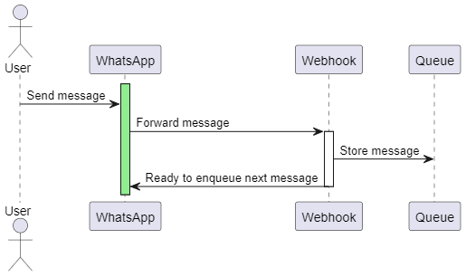
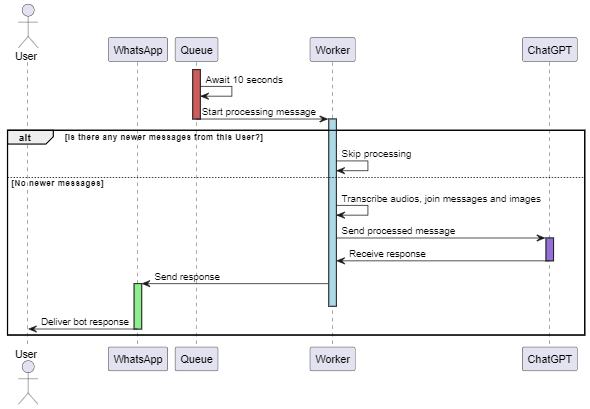

# FinBot: Integrando ChatGPT com WhatsApp (WIP)

O objetivo deste projeto é entender o funcionamento das APIs do WhatsApp e OpenAI, criando um bot de finanças pessoais. Ele permite registrar seus gastos diários de forma automatizada. Para saber como instalar, [clique aqui](#instalacao).

## Recebendo Mensagens



A aplicação conta com um webhook cadastrado no painel do Facebook, que recebe as mensagens enviadas pelos usuários e as armazena em uma fila. O processamento dessas mensagens ocorre após um intervalo de 10 segundos.

## Processando Mensagens



Decorridos os 10 segundos, a aplicação inicia o processamento das mensagens, verificando se o usuário enviou novas mensagens mais recentes. Caso existam, o processamento atual é ignorado.

Se não houver mensagens mais recentes, todas as mensagens e mídias do usuário são agrupadas para formar um único prompt. Isso inclui a transcrição de áudios, caso existam. Após essa consolidação, a mensagem é enviada ao ChatGPT, que extrai informações sobre transações financeiras e gera uma saída estruturada.

Atualmente, o bot apenas extrai as informações e responde ao usuário. A persistência dos dados em um banco de dados não é o foco deste projeto, mas quem sabe em uma próxima versão... 😉

## Instalação

Este guia assume que você já possui conhecimento prévio sobre as ferramentas utilizadas.

### Requisitos

1. Instale o **Python**.
2. Instale o **Docker**.
3. Crie uma conta na **OpenAI** e obtenha uma chave de API.
   - Para facilitar, acesse o [painel de desenvolvimento da OpenAI](https://platform.openai.com/api-keys).
4. Obtenha um **Auth Token** do **NGROK**.
   - Consulte a [documentação](https://dashboard.ngrok.com/get-started/setup/windows) para configurar.
   - O NGROK é essencial para criar um webhook válido no portal do Facebook, facilitando o desenvolvimento.
   - Caso já possua um endpoint válido, pode utilizá-lo.
5. Configure uma conta de **desenvolvedor do Facebook**.
   - Esse processo pode ser trabalhoso, pois o portal de desenvolvimento do Facebook é complexo.
   - É necessário criar um aplicativo na conta de desenvolvedor e habilitar a API do WhatsApp para o projeto.

### Como Utilizar

1. Clone este repositório.
2. No terminal, execute o seguinte comando para instalar as dependências:

   ```sh
   pip install -r requirements.txt
   ```

3. Crie um arquivo `.env` baseado em `.env.sample` e preencha os dados necessários.
   - **VERIFY\_TOKEN**: Utilizado pelo Facebook para validar o webhook.
   - **WHATSAPP\_TOKEN** e **PHONE\_NUMBER\_ID**: Gerados no painel do Facebook.
4. No diretório do projeto, execute:

   ```sh
   docker compose up -d
   ```

5. Nos logs do NGROK, copie o endpoint gerado e cadastre no painel do Facebook junto com seu **VERIFY\_TOKEN**.

E pronto! 🎉 Seu bot estará funcionando. 🤖🔥
